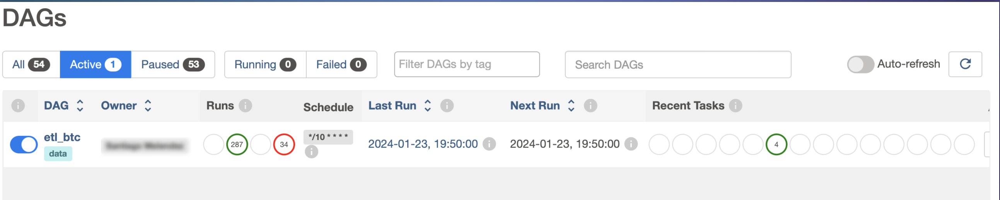
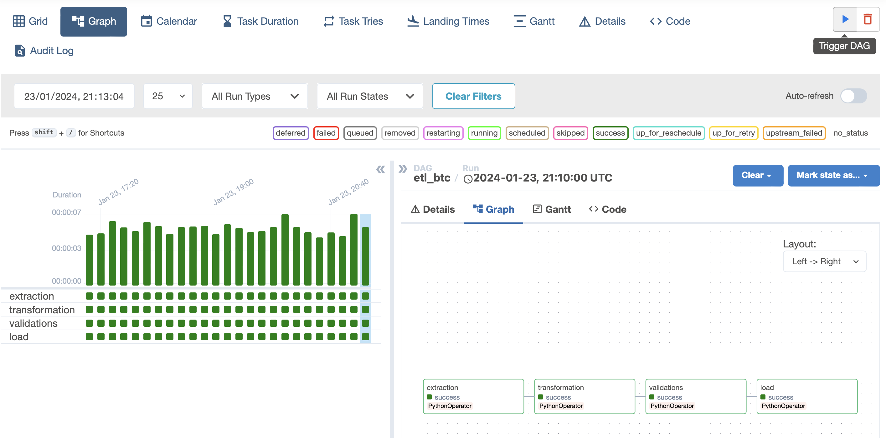
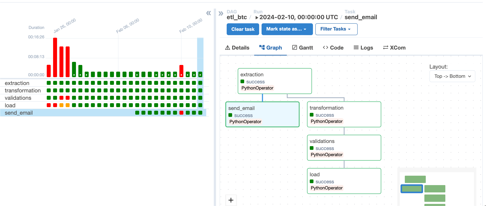

# ETL Pipeline for Binance Klines

Automated Extraction and Storage for Crypto Market Analysis with Airflow

## Table of Contents
1. [Introduction](#introduction)
2. [Prerequisites](#prerequisites)
3. [Requirements](#requirements)
4. [Configuration](#configuration)
5. [Getting Started](#getting-started)
6. [Usage](#usage)
7. [Project Structure](#project-structure)
8. [Airflow DAGs](#airflow-dags)
9. [Email Alerts](#email-alerts)


## Introduction

Binance Klines ETL, is a data processing solution designed to extract and store Klines data from the Binance cryptocurrency exchange

## Prerequisites

- [Docker](https://www.docker.com/) installed
- [Docker Compose](https://docs.docker.com/compose/install/) installed

## Requirements

This project is written in Python, and its requirements include:

1. **Programming Language:**
   - Python 3.x

2. **Dependencies**
   ```bash
    requests
    pandas
    psycopg2-binary
    sqlalchemy
    ```

3. **External APIs:**
   - Binance API (for data extraction)

4. **Orchestrator:**
   - Apache Airflow version 2.8.1

## Configuration

Before running the project make sure that ```.env``` was set.
Rename the file env_example to .env and set your enviroment variables.


## Getting Started

These instructions will help you get a copy of the project up and running on your local machine for development and testing purposes.

1. Clone the Repository.
2. Start airflow locally.

```bash
docker-compose up airflow-init
docker-compose up --build
```
The etl_btc DAG willl be triggered by the scheduler according its schedule

3. For logging airflow to use the results and configurations open your web browser and go to ```http://localhost:8080``` 

4. Login to airflow with dafault credentials


## Usage

For Trigger the DAGS manually,  once you've been logged to airflow do the following

4. Filter by active DAGs


5. If you want to trigger the dag manually select dag and click on the play button



## Project Structure

THe sctructure fo the project is:
```bash
├── dags
│   └── etl_btcusdt.py
├── etl
│   ├── __init__.py
│   ├── extraction.py
│   ├── transformation.py
│   ├── upload.py
│   └── validations.py
├── migrations
│   ├── aws-redshift-table.png
│   └── create_table.sql
└── utils
    ├── __init__.py
    ├── pandas_helpers.py
    └── persistence.py
```


## Airflow DAGs
The Airflow Directed Acyclic Graphs (DAGs) included in the project:

* etl_btc:
    * Propose: Goal: Get the ```BTCUSDT``` candlesticks hourly for the before daybefore today 
    * schedule: @daily

   

## Email Alerts
One of the task of the flow contains the email sent in case the price reached a specific value.
To configure this task, it's only have to create the folder ```credentials``` and add the file ```google_credentials.json``` with your google oauth2 credentials.



The emails sent looks like:
